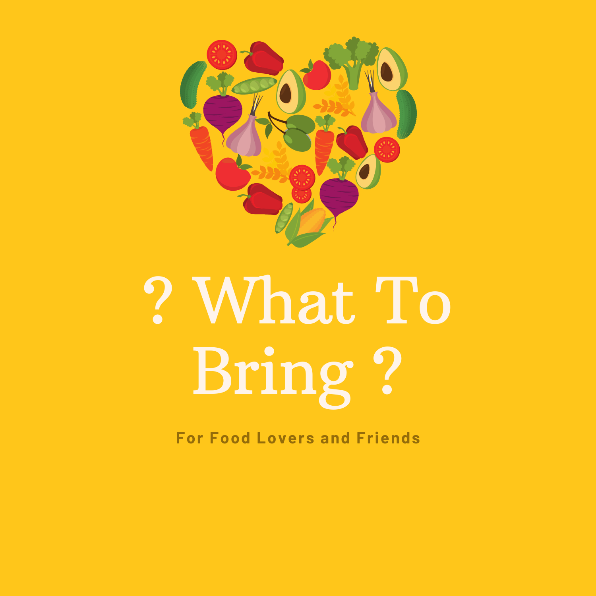
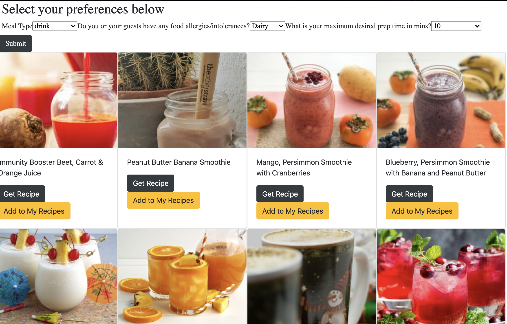

[![Contributors][contributors-shield]][contributors-url]
[![Forks][forks-shield]][forks-url]
[![Stargazers][stars-shield]][stars-url]
[![Issues][issues-shield]][issues-url]
[![MIT License][license-shield]][license-url]
[![LinkedIn][linkedin-shield]][linkedin-url]


<!-- PROJECT LOGO -->
<br />
<p align="center">
  <a href="https://github.com/luceestrong/WhatToBring">
    
  </a>

  <h3 align="center"></h3>

  <p align="center">
    WhatToBring is a recipe search app created for users who need easy recipes in seconds to feed their friends. Users can search recipes based on food intolerances/allergies, meal type, and desired meal prep time.
    <br />
    <a href="https://github.com/luceestrong/WhatToBring"><strong>Explore the docs »</strong></a>
    <br />
    <br />
    <a href="https://github.com/luceestrong/WhatToBring">View Demo</a>
    ·
    <a href="https://github.com/luceestrong/WhatToBring/issues">WhatToBring Report Bug</a>
    ·
    <a href="https://github.com/luceestrong/WhatToBring/issues">Request Feature</a>
  </p>
</p>


<!-- TABLE OF CONTENTS -->
<details open="open">
  <summary><h2 style="display: inline-block">Table of Contents</h2></summary>
  <ol>
    <li>
      <a href="#about-the-project">About The Project</a>
      <ul>
        <li><a href="#built-with">Built With</a></li>
      </ul>
    </li>
    <li>
      <a href="#getting-started">Getting Started</a>
      <ul>
        <li><a href="#prerequisites">Prerequisites</a></li>
        <li><a href="#installation">Installation</a></li>
      </ul>
    </li>
    <li><a href="#usage">Usage</a></li>
    <li><a href="#roadmap">Roadmap</a></li>
    <li><a href="#contributing">Contributing</a></li>
    <li><a href="#license">License</a></li>
    <li><a href="#contact">Contact</a></li>
    <li><a href="#acknowledgements">Acknowledgements</a></li>
  </ol>
</details>


<!-- ABOUT THE PROJECT -->
## About The Project

**App Demo**

<br></br>

**Home Page**

<br></br>
**Recipe Search Page**


### Built With

* [React Bootstrap](https://react-bootstrap.github.io/)
* [Express](https://expressjs.com/)
* [React](https://reactjs.org/)


<!-- GETTING STARTED -->
## Getting Started

To get a local copy up and running follow these simple steps.

### Prerequisites

* npm
  ```sh
  npm install npm@latest -g
  ```

### Installation

1. Clone the WhatToBring
   ```sh
   git clone https://github.com/luceestrong/WhatToBring.git
   ```
2. Install NPM packages
   ```sh
   npm install
   ```


<!-- CONTRIBUTING -->
## Contributing

Contributions are what make the open source community such an amazing place to be learn, inspire, and create. Any contributions you make are **greatly appreciated**.

1. Fork the Project
2. Create your Feature Branch (`git checkout -b feature/AmazingFeature`)
3. Commit your Changes (`git commit -m 'Add some AmazingFeature'`)
4. Push to the Branch (`git push origin feature/AmazingFeature`)
5. Open a Pull Request


<!-- LICENSE -->
## License

Distributed under the MIT License. See `LICENSE` for more information.

<!-- CONTACT -->
## Contact

Lucy Armstrong -  https://www.linkedin.com/in/lucyarmstrong1/ - lucyarmstrong45@gmail.com - [@Lucyyystrong](https://twitter.com/Lucyyystrong)

Project Link: [https://github.com/luceestrong/WhatToBring](https://github.com/luceestrong/WhatToBring)

<!-- MARKDOWN LINKS & IMAGES -->
<!-- https://www.markdownguide.org/basic-syntax/#reference-style-links -->
[contributors-shield]: https://img.shields.io/github/contributors/luceestrong/WhatToBring.svg?style=for-the-badge
[contributors-url]: https://github.com/luceestrong/WhatToBring/graphs/contributors
[forks-shield]: https://img.shields.io/github/forks/luceestrong/WhatToBring.svg?style=for-the-badge
[forks-url]: https://github.com/luceestrong/WhatToBring/network/members
[stars-shield]: https://img.shields.io/github/stars/luceestrong/WhatToBring.svg?style=for-the-badge
[stars-url]: https://github.com/luceestrong/WhatToBring/stargazers
[issues-shield]: https://img.shields.io/github/issues/luceestrong/WhatToBring.svg?style=for-the-badge
[issues-url]: https://github.com/luceestrong/WhatToBring/issues
[license-shield]: https://img.shields.io/github/license/luceestrong/WhatToBring.svg?style=for-the-badge
[license-url]: https://github.com/luceestrong/WhatToBring/blob/master/LICENSE.txt
[linkedin-shield]: https://img.shields.io/badge/-LinkedIn-black.svg?style=for-the-badge&logo=linkedin&colorB=555
[linkedin-url]: https://linkedin.com/in/luceestrong
